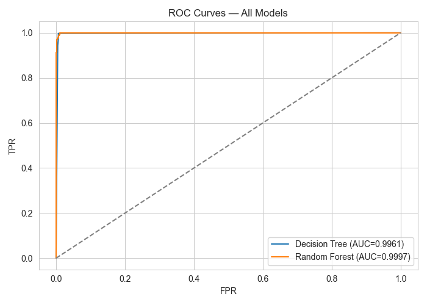
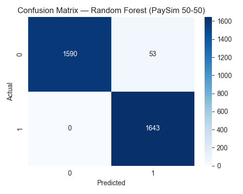

# 🛡️ SwipeSafe — AI-Powered Financial Fraud Detection


> A real-time financial fraud detection dashboard powered by a Random Forest Classifier trained on the PaySim synthetic financial dataset.

---

## 📸 Screenshots

| Hero Dashboard | Prediction Output |
|---|---|
|  |  |

---

## 🚀 Features

- 🔍 **Single Transaction Analysis** — Enter transaction details and get instant fraud probability score
- 📂 **Bulk CSV Processing** — Upload thousands of transactions and download predictions
- 📊 **Model Analytics** — View ROC curve, PR curve, confusion matrix and feature importance
- 🤖 **Model Comparison** — Automatically compares Decision Tree, XGBoost and Random Forest
- 🎨 **Modern Dark UI** — Professional fintech-style dashboard built with Streamlit
- ⚡ **Real-Time Prediction** — Instant results with fraud probability progress bar

---

## 📁 Project Structure

```
frauddetection/
│
├── app.py                          # Streamlit dashboard (main application)
├── model.py                        # Model training & comparison script
│
├── paysim.csv                      # Raw PaySim dataset (not included - see below)
├── paysim_50_balanced.csv          # Balanced 50:50 training dataset
├── paysim_balanced_sample.csv      # Sample dataset for testing
│
├── paysim_50_model.pkl             # Trained Random Forest model
├── paysim_50_scaler.pkl            # StandardScaler for feature scaling
│
├── paysim_50_roc_curve.png         # ROC curve chart
├── paysim_50_pr_curve.png          # Precision-Recall curve chart
├── paysim_50_confusion_matrix.png  # Confusion matrix chart
├── paysim_50_feature_importance.png # Feature importance chart
├── paysim_50_model_comparison.png  # Model comparison bar chart
│
├── paysim_50_classification_report.txt  # Full classification report
└── requirements.txt                # Python dependencies
```

---

## 🧠 Machine Learning Models Compared

| Model | Accuracy | ROC-AUC | Selected |
|-------|----------|---------|----------|
| Decision Tree | 99.54% | 0.9961 | ❌ |
| XGBoost | ~98% | ~0.998 | ❌ |
| **Random Forest** | **98.39%** | **0.9997** | ✅ |

> **Why Random Forest?** It achieves the highest ROC-AUC (0.9997) which is the most important metric for fraud detection on imbalanced datasets. A high ROC-AUC means the model correctly distinguishes fraud from legitimate transactions across all decision thresholds.

---

## 📊 Model Performance

```
Classification Report (threshold=0.28)

              precision    recall  f1-score   support

           0     1.0000    0.9677    0.9836      1643
           1     0.9688    1.0000    0.9841      1643

    accuracy                         0.9839      3286
   macro avg     0.9844    0.9839    0.9839      3286
weighted avg     0.9844    0.9839    0.9839      3286

ROC-AUC: 0.999664
```

---

## ⚙️ Installation & Setup

### Prerequisites
- Python 3.10 or higher
- pip package manager

### Step 1 — Clone the repository
```bash
git clone https://github.com/yourusername/swipesafe.git
cd swipesafe
```

### Step 2 — Create a virtual environment
```bash
python3 -m venv .venv
source .venv/bin/activate        # Mac/Linux
.venv\Scripts\activate           # Windows
```

### Step 3 — Install dependencies
```bash
pip install -r requirements.txt
```

### Step 4 — Install XGBoost dependency (Mac only)
```bash
brew install libomp
```

### Step 5 — Add the dataset
Download the PaySim dataset from [Kaggle](https://www.kaggle.com/datasets/ealaxi/paysim1) and place it in the project folder as `paysim.csv`

### Step 6 — Train the model
```bash
python3 model.py
```

### Step 7 — Run the app
```bash
python3 -m streamlit run app.py
```

Open your browser at `http://localhost:8501`

---

## 📦 Requirements

Create a `requirements.txt` with:

```
streamlit>=1.28.0
pandas>=2.0.0
numpy>=1.24.0
scikit-learn>=1.3.0
xgboost>=2.0.0
joblib>=1.3.0
matplotlib>=3.7.0
seaborn>=0.12.0
```

Install with:
```bash
pip install -r requirements.txt
```

---

## 📋 Input Features

| Feature | Description |
|---------|-------------|
| `step` | Hour of the simulation (0–10000) |
| `amount` | Transaction amount |
| `oldbalanceOrg` | Sender balance before transaction |
| `newbalanceOrig` | Sender balance after transaction |
| `oldbalanceDest` | Receiver balance before transaction |
| `newbalanceDest` | Receiver balance after transaction |
| `type_TRANSFER` | 1 if transaction type is TRANSFER |
| `type_CASH_OUT` | 1 if transaction type is CASH_OUT |

---

## 🔄 How It Works

```
User Input → StandardScaler → Random Forest → Probability Score → Threshold (0.28) → FRAUD / LEGIT
```

1. User enters transaction details in the dashboard
2. `Amount` and `Time` features are scaled using StandardScaler
3. Random Forest Classifier predicts fraud probability (0.0 to 1.0)
4. If probability ≥ 0.28 → **FRAUDULENT** 🚨
5. If probability < 0.28 → **LEGITIMATE** ✅

---

## 📂 Bulk CSV Format

Upload a CSV file with these columns:

```
step, amount, oldbalanceOrg, newbalanceOrig, oldbalanceDest, newbalanceDest, type
```

Where `type` values are: `TRANSFER`, `CASH_OUT`, `PAYMENT`, `DEBIT`, `CASH_IN`

---

## 🗂️ Dataset

This project uses the **PaySim** synthetic financial dataset simulating mobile money transactions.

- **Source:** [Kaggle — PaySim1](https://www.kaggle.com/datasets/ealaxi/paysim1)
- **Original Paper:** Lopez-Rojas, E., Elmir, A., & Axelsson, S. (2016). PaySim: A financial mobile money simulator for fraud detection.
- **Size:** 6.3 million transactions
- **Fraud Rate:** ~0.13% (highly imbalanced)
- **Sampling:** 50:50 balanced sampling used for training (8,213 fraud + 8,213 legitimate)

---

## ⚠️ Disclaimer

SwipeSafe is developed as an **academic prototype** for educational purposes. It must not be used as the sole basis for real-world financial or legal decisions. All AI outputs require human review before any action is taken. The model was trained on synthetic data and performance may differ on real-world transaction data.

---

## 👩‍💻 Author

**Your Name**
- GitHub: [@yourusername](https://github.com/yourusername)
- Project: SwipeSafe — Final Year AI Project

---

## 📄 License

This project is licensed for academic use only. The PaySim dataset is credited to its original authors. All rights reserved.

---

<div align="center">
  <b>SwipeSafe · AI Fraud Detection · Random Forest · PaySim · Streamlit</b>
</div>
